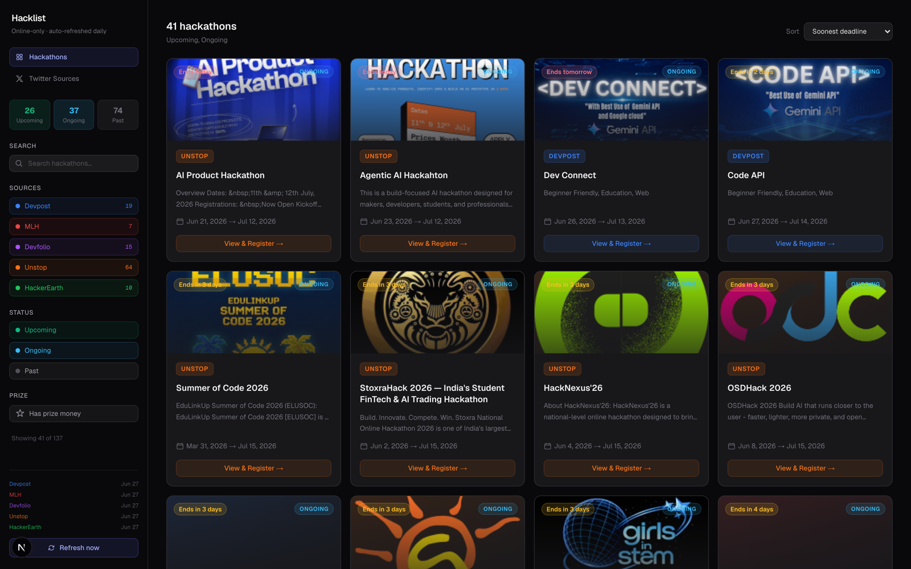

# Hacklist

**One dashboard for every online hackathon.** Hacklist aggregates listings from six sources — Devpost, MLH, Devfolio, Unstop, HackerEarth, and Twitter/X — scrapes them on a daily schedule, and serves them in a fast, filterable dashboard so you never have to check each platform individually.




## Features

- **Six sources, one view** — Devpost, MLH, Devfolio, Unstop, HackerEarth, and Twitter/X, deduplicated by URL
- **Auto-refresh** — a background scheduler re-scrapes all sources every 24 hours; trigger a manual refresh anytime from the sidebar
- **Filter & sort** — by source, status (upcoming / ongoing / past), prize, and free-text search; sort by soonest deadline, start date, or recently added
- **Shareable views** — filters are encoded in the URL, so any filtered view can be bookmarked or shared
- **Status tracking** — hackathons move through upcoming → ongoing → past automatically based on their dates
- **Deadline badges** — "Ends today / Ends in 3 days" chips surface what's closing soon

## Architecture

The app runs as **two processes**:

| Part | Stack | Port | Entry point |
|------|-------|------|-------------|
| Backend API | FastAPI + APScheduler + SQLite | **8001** | `api.py` |
| Frontend | Next.js (App Router) + Tailwind | **3000** | `frontend/` |

- The frontend calls the backend at the URL in `frontend/.env.local` (`NEXT_PUBLIC_API_URL`, default `http://localhost:8001`), so **both must be running**.
- Scrapers live in `scrapers/` (one module per source). `scheduler.py` runs all of them every 24 hours; the first launch with an empty database also kicks off an immediate scrape.
- Data is stored in SQLite (`hackathons.db`). Twitter scraping uses `twscrape`, which keeps its own account store in `accounts.db`. Both `*.db` files are git-ignored.

There is also an alternative all-in-one **Streamlit** UI in `app.py` (no separate frontend needed) — see [Alternative: Streamlit UI](#alternative-streamlit-ui).

## Quick start

### Prerequisites

- **Python 3.14+**
- **Node.js 20+**

### 1. Backend

```bash
python3 -m venv .venv
.venv/bin/pip install -r requirements.txt

cp .env.example .env   # optional — only needed for the Twitter source

.venv/bin/python -m uvicorn api:app --host 127.0.0.1 --port 8001
```

The only credentials are for **Twitter/X**, and they are **optional** — the other five sources need none. If you skip them, the Twitter scrape simply fails and is logged. Use a throwaway/burner account; the scraper authenticates with session cookies (`TWITTER_AUTH_TOKEN`, `TWITTER_CT0`) — see `.env.example`.

### 2. Frontend

```bash
cd frontend
npm install
npm run dev
```

Then open **http://localhost:3000**. On first run with an empty database, the backend triggers a background scrape — give it ~30 seconds and refresh, or hit **Refresh now** in the sidebar.

## API

The backend exposes a small JSON API (consumed by the frontend):

| Method | Path | Description |
|--------|------|-------------|
| `GET`  | `/api/hackathons` | List hackathons (cross-source deduplicated). Query params: `sources`, `statuses`, `search`, `has_prize`, `limit`, `offset`. |
| `GET`  | `/api/hackathons/{id}/calendar.ics` | Download a hackathon as an iCalendar event. |
| `GET`  | `/api/stats` | Totals by source/status + per-source last-scrape times. |
| `POST` | `/api/refresh` | Trigger a background re-scrape of all sources. Set `REFRESH_TOKEN` in the environment to require an `X-Refresh-Token` header. |
| `GET`  | `/api/status` | Whether a scrape is currently running. |

Interactive docs are auto-generated at `http://localhost:8001/docs`.

## Alternative: Streamlit UI

`app.py` is a self-contained Streamlit dashboard over the same database and scrapers — handy if you don't want to run the separate frontend:

```bash
.venv/bin/python -m streamlit run app.py
```

## Project layout

```
api.py          FastAPI backend (serves the Next.js frontend)
app.py          Streamlit UI (alternative, standalone)
scheduler.py    Runs all scrapers; daily 24h job
db.py           SQLite access + status logic
scrapers/       One module per source (devpost, mlh, devfolio, unstop, hackerearth, twitter)
frontend/       Next.js + Tailwind dashboard
docs/           Screenshots and documentation assets
```

## Development

```bash
.venv/bin/python -m pip install -r requirements-dev.txt
.venv/bin/python -m pytest tests/
```

CI runs the Python test suite plus frontend lint/build on every push (`.github/workflows/ci.yml`).

## Roadmap

- [x] Cross-source deduplication (same event listed on multiple platforms)
- [x] Scraper fixture tests + CI
- [x] Calendar export (`.ics`)
- [ ] Hosted deployment (Vercel + Railway)
- [ ] Normalized prize parsing (currency-aware sorting)
- [ ] Email deadline reminders
